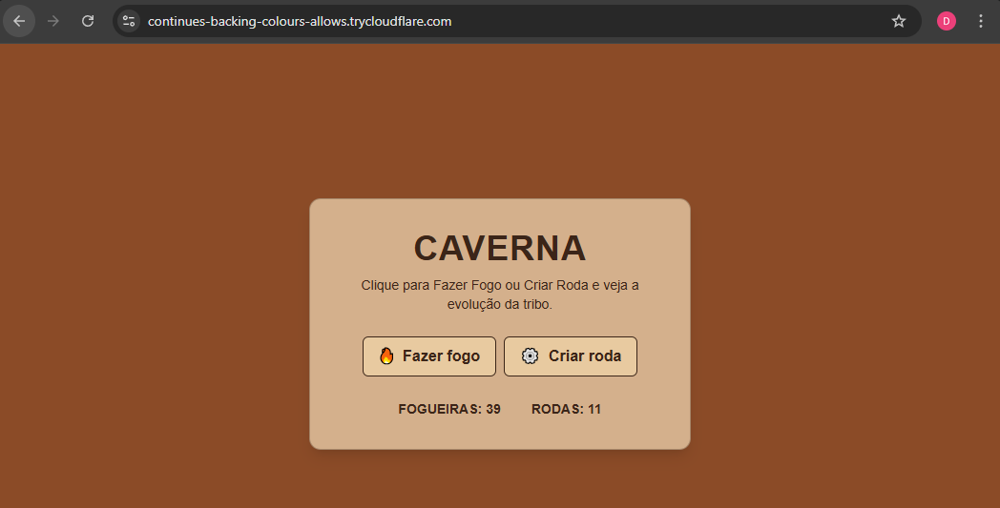

# Caverna – Infraestrutura

Este repositório descreve o passo a passo para executar localmente e expor publicamente um projeto composto por:
- **Backend:** .NET 8 Web API  
- **Frontend:** Next.js 14+  
- **Reverse Proxy:** Nginx com SSL local  
- **Túnel seguro:** Cloudflare Tunnel (para acesso via qualquer dispositivo)
  
---


📝 **Observação**
Provavelmente esqueci algum comando ou configuração, irei editar este arquivo quando tentar fazer outro deploy futuramente.

---

## ⚙️ 1. Instalar dependências no Ubuntu

```bash
sudo apt update && sudo apt upgrade -y
sudo apt install git curl wget nano nginx -y

sudo systemctl status nginx
```

### .NET 8 SDK
```bash
wget https://packages.microsoft.com/config/ubuntu/24.04/packages-microsoft-prod.deb -O packages-microsoft-prod.deb
sudo dpkg -i packages-microsoft-prod.deb
sudo apt update
sudo apt install -y dotnet-sdk-8.0 aspnetcore-runtime-8.0
```

### Node.js 20 + NPM
```bash
curl -fsSL https://deb.nodesource.com/setup_20.x | sudo -E bash -
sudo apt install -y nodejs
```

---

## 🧩 2. Clonar e configurar os projetos

```bash
cd ~/projetos
git clone <repositorio>
```

Crie o arquivo `.env.local` no frontend:

```bash
cd ~/projetos/Caverna/frontend/caverna.Web
nano .env.local
```

Conteúdo:
```
NEXT_PUBLIC_API_URL=http://localhost:5000/api/caverna
```

---

## 🚀 3. Rodar localmente

### Backend (.NET)
```bash
cd ~/projetos/Caverna/BACKEND/Caverna.API
dotnet run
```

A API rodará em `http://localhost:5000`

---

### Frontend (Next.js)
```bash
cd ~/projetos/Caverna/frontend/caverna-web
npm install
npm run dev
```

O frontend rodará em `http://localhost:3000`

---

## 🔒 4. Configurar HTTPS com Nginx(etapa funciona local porém ao expor na web a rota está bloqueada, pular para tunél CloudFare etapa 5, causa do erro interferencia de Modo Bridge da máquina virtual com placa de rede, acessando Port Forwarding do wi-fi apenas com login/senha perca de acesso a internet.)

Gerar certificados locais:
```bash
sudo mkdir /etc/ssl/caverna
sudo openssl req -x509 -nodes -days 365 -newkey rsa:2048   -keyout /etc/ssl/caverna/caverna.key   -out /etc/ssl/caverna/caverna.crt   -subj "/CN=localhost"
```

Criar arquivo de configuração:
```bash
sudo nano /etc/nginx/sites-available/caverna
```

Conteúdo:
```nginx
server {
    listen 443 ssl;
    server_name localhost;

    ssl_certificate /etc/ssl/caverna/caverna.crt;
    ssl_certificate_key /etc/ssl/caverna/caverna.key;

    location /api/ {
        proxy_pass http://localhost:5000/;
    }

    location / {
        proxy_pass http://localhost:3000/;
    }
}

server {
    listen 80;
    server_name localhost;
    return 301 https://$host$request_uri;
}
```

Ativar:
```bash
sudo ln -s /etc/nginx/sites-available/caverna /etc/nginx/sites-enabled/
sudo nginx -t
sudo systemctl restart nginx
```

Acesse:  
👉 [https://localhost](https://localhost)

---

## ☁️ 5. Expor via Cloudflare Tunnel

1. **Instalar o Cloudflare Tunnel**
   ```bash
    sudo mkdir -p /usr/local/etc/cloudflared
    wget -q https://github.com/cloudflare/cloudflared/releases/latest/download/cloudflared-linux-amd64.deb
    sudo dpkg -i cloudflared-linux-amd64.deb

    cloudflared --version
   ```

2. **Garantir que o Nginx use HTTP local**
   ```bash
   sudo nano /etc/nginx/sites-available/caverna.conf

    server {
        listen 80;
        server_name localhost;

        location / {
            proxy_pass http://127.0.0.1:3000; # porta do Next.js
            proxy_set_header Host $host;
            proxy_set_header X-Real-IP $remote_addr;
            proxy_set_header X-Forwarded-For $proxy_add_x_forwarded_for;
            proxy_set_header X-Forwarded-Proto $scheme;
        }

        location /api/ {
            proxy_pass http://127.0.0.1:5000/; # porta da API .NET
            proxy_set_header Host $host;
            proxy_set_header X-Real-IP $remote_addr;
            proxy_set_header X-Forwarded-For $proxy_add_x_forwarded_for;
            proxy_set_header X-Forwarded-Proto $scheme;
        }
    }
   ```

   Salve e aplique:
   ```bash
   sudo nginx -t
   sudo systemctl reload nginx
   ```
   

2. **Criar túnel temporário(gratuito)**
   BackEnd
   ```bash
   cloudflared tunnel --url http://localhost:5000
   
   ```
   FrontEnd
   ```bash
   cloudflared tunnel --url http://localhost:3000
   ```
   Exemplo de saída:
   ```bash
   Your quick Tunnel has been created!
   Visit it at: https://copying-intranet-explosion-jun.trycloudflare.com
   ```

4. **Atualizar variáveis do Frontend**
   Abra .env.local e substitua:
   ```bash
   NEXT_PUBLIC_API_URL=https://copying-intranet-explosion-jun.trycloudflare.com/api/caverna
   ```

    #Reinicie
   ```bash
   npm run dev
   ```

Agora seu app estará disponível publicamente em:
👉 **https://seu-endereco-frontend.trycloudflare.com**

<p align="center">
  
</p>
